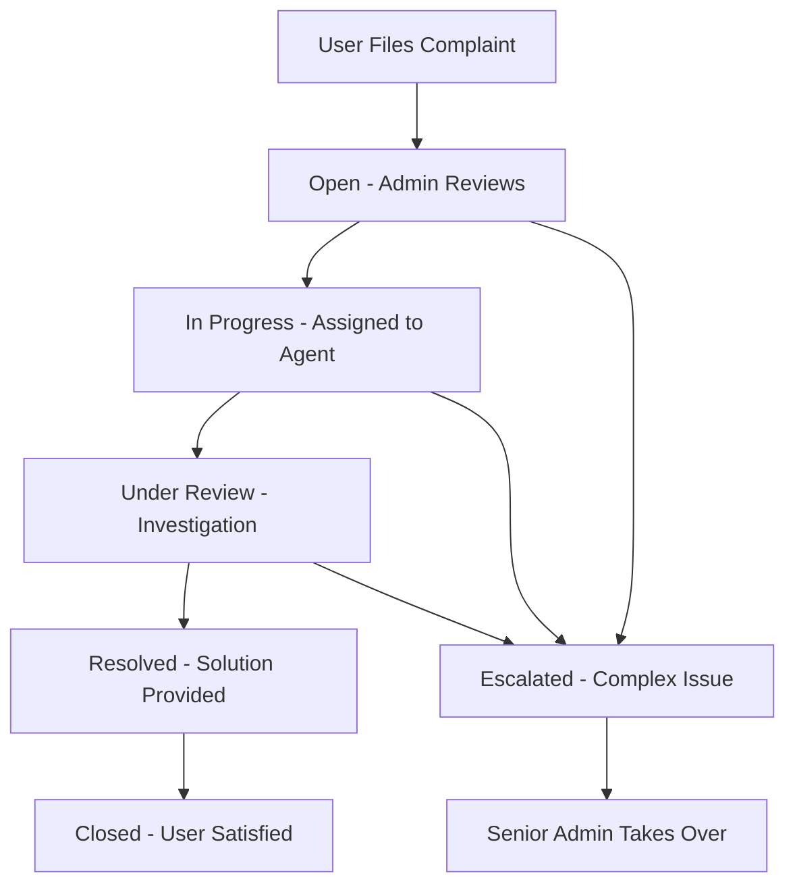

# User-Admin Coordination in Complaint Management System

## 🔄 How Users and Admins Work Together

### User Journey 👤
1. **File Complaint**: User fills out complaint form with title, description, category
2. **AI Processing**: System automatically categorizes and prioritizes the complaint
3. **Tracking**: User receives ticket ID and can track progress in real-time
4. **Communication**: User can add comments and respond to admin questions
5. **Resolution**: User receives notifications when status changes
6. **Feedback**: User rates the service after resolution

### Admin Journey 🛠️
1. **Receive Alert**: Admin gets notified of new complaints
2. **Review & Assign**: Admin reviews details and assigns to appropriate team/agent
3. **Status Management**: Admin updates status (Open → In Progress → Resolved)
4. **Communication**: Admin can ask for clarifications or provide updates
5. **Escalation**: Admin can escalate complex or urgent issues
6. **Analytics**: Admin monitors performance metrics and SLA compliance

## 🤝 Coordination Points

### Real-Time Communication
- **User adds comment** → Admin receives notification
- **Admin responds** → User gets instant notification
- **Status changes** → Both parties see updates immediately

### Assignment Process
1. **New Complaint Filed**
   ```
   User submits → AI categorizes → Admin inbox → Assign to team
   ```

2. **Team Assignment**
   - Technical issues → Technical Support Team
   - Billing problems → Billing Department  
   - General inquiries → Customer Service
   - Product issues → Product Support Team

### Status Flow & Coordination



### Communication Examples

#### User → Admin Interactions
- **"I need to add more details about my billing issue"**
  - User adds comment → Admin gets notification → Admin responds

- **"The suggested solution didn't work"**
  - User reopens complaint → Admin reassigns → New agent takes over

#### Admin → User Interactions
- **"Can you provide your account number for faster resolution?"**
  - Admin requests info → User gets notification → User provides details

- **"We've identified the issue and applied a fix to your account"**
  - Admin updates status to "Resolved" → User gets notification → User can provide feedback

## 📊 Admin Dashboard Features for Coordination

### Overview Section
- **Critical Complaints**: Urgent issues requiring immediate attention
- **Team Performance**: Monitor which teams are handling what volumes
- **Quick Stats**: Total complaints, resolution rates, satisfaction scores

### Complaint Management
- **Search & Filter**: Find specific complaints by user, category, priority
- **Bulk Actions**: Assign multiple complaints to teams simultaneously  
- **Status Updates**: Change complaint status with automatic user notifications
- **Assignment**: Assign complaints to specific agents or teams

### Communication Tools
- **Comment System**: Direct messaging with users on specific complaints
- **Status Notifications**: Automatic updates when progress is made
- **Escalation Alerts**: Notify senior staff when issues are escalated

## 🎯 User Dashboard Features for Coordination

### Complaint Tracking
- **Progress Bar**: Visual indication of complaint resolution progress
- **Status History**: Timeline of all actions taken on the complaint
- **Response Time**: Expected resolution timeframe based on priority

### Communication Hub
- **AI Chatbot**: 24/7 support for quick questions and status checks
- **Comment Thread**: Direct communication with assigned agents
- **Notification Center**: All updates and responses in one place

### Feedback Loop
- **Satisfaction Rating**: Rate the service quality (1-5 stars)
- **Comments**: Provide detailed feedback on resolution experience
- **Resolution Confirmation**: Confirm whether the issue was actually resolved

## 🔄 Coordination Workflow Example

### Billing Issue Resolution
1. **User**: "I was charged twice for my subscription"
2. **System**: Auto-categorizes as "Billing" with "High" priority
3. **Admin**: Receives alert, assigns to Billing Department agent Sarah
4. **Sarah**: Reviews account, finds duplicate charge
5. **Sarah → User**: "We found the duplicate charge. Refund will be processed in 3-5 business days"
6. **System**: Status updated to "Resolved", user gets notification
7. **User**: Confirms refund received, rates service 5 stars
8. **System**: Complaint marked as "Closed", satisfaction recorded

### Technical Issue Escalation
1. **User**: "Website keeps crashing when I try to upload files"
2. **System**: Auto-categorizes as "Technical" with "Medium" priority  
3. **Admin**: Assigns to Technical Support agent Mike
4. **Mike**: Initial troubleshooting, asks for browser details
5. **User**: Provides browser info and error screenshots
6. **Mike**: Identifies complex server issue, escalates to Senior Dev Team
7. **Admin**: Updates status to "Escalated", assigns to DevOps team
8. **DevOps**: Fixes server configuration, tests solution
9. **Admin**: Status updated to "Resolved", user gets detailed resolution notes
10. **User**: Tests and confirms fix works, provides positive feedback

## 📈 Performance Metrics Tracked

### For Admins
- **First Response Time**: How quickly initial response is provided
- **Resolution Time**: Average time to fully resolve complaints
- **SLA Compliance**: Percentage of cases resolved within target timeframes
- **Customer Satisfaction**: Average rating from resolved complaints
- **Escalation Rate**: Percentage of complaints that require escalation

### For Users  
- **Response Tracking**: See when your message was read and responded to
- **Progress Updates**: Real-time status of your complaint resolution
- **Estimated Resolution**: AI-powered prediction of resolution timeframe
- **Resolution Quality**: Track whether solutions actually worked

## 🚀 Advanced Coordination Features

### AI-Powered Assignment
- **Smart Routing**: AI suggests best team/agent based on complaint content
- **Workload Balancing**: Distributes complaints evenly across available agents
- **Expertise Matching**: Routes complex issues to specialists automatically

### Proactive Communication
- **SLA Alerts**: Notify both user and admin when deadline approaches
- **Auto-Updates**: System automatically provides status updates
- **Satisfaction Follow-up**: Automatic check-in after resolution

### Integration Points
- **CRM Integration**: Complaint data syncs with customer relationship systems
- **Analytics Dashboard**: Real-time reporting on coordination effectiveness
- **Knowledge Base**: Common solutions shared between admins and users

This coordination system ensures that users always know the status of their complaints while giving admins the tools they need to provide efficient, high-quality customer service. The real-time communication and automated processes minimize delays and improve satisfaction for both parties.
